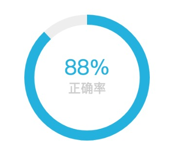

# simple doughnut chart

## 安装

``` bash
npm i --save simple-doughnut-chart
```


## 特点
* 兼容所有浏览器（包括ie6,7,8），需引入excanvas.js，请看git仓库示例代码
* 更好的支持retina屏
* 支持过渡动画（ie9及其他主流浏览器）


## 使用

``` js
import DoughnutChart from 'simple-doughnut-chart';

new DoughnutChart(document.getElementById('canvas'), {
    canvasSize: 150,            // canvas宽高大小
    doughnutSize: 12,           // 圆环直径大小
    defaultTextSize: 15,        // 默认文字大小
    activeTextSize: 25,         // 激活文本大小
    defaultColor: '#eee',       // 圆环默认颜色
    defaultTextColor: '#ccc',   // 默认文本颜色
    activeColor: '#13b0df',     // 圆环激活颜色
    percentageColor: '#13b0df', // 百分比文字颜色，如果未传，则为圆环激活颜色
    percentage: 88,             // 百分比，text不传或值为空字符串，则居中显示
    decimalPointDigit: 0,       // 保留的小数点位数，默认为0，如果小数点末尾为0，则不显示
    forceDecimalPointDigit: -1,  // 强制保留的小数点位数，默认为-1，不做强制处理，当值设置大于等于0时，且百分比小数点末尾为0，也将显示，将会覆盖decimalPointDigit的值
    text: '正确率',              // 文本
    duration: 1500,             // 动画持续时间，为0将禁用过渡动画
    dashWidth: 12,              // (百分比占位符)破折号宽
    dashHeight: 4,              // 破折号高
    dashMargin: 6,              // 破折号之间的间隔
    dashLength: 3,               // 破折号个数
    dashColor: '#eee',           // 破折号颜色

    // 1.3.0版本新增配置项
    textPosition: 'top',        // 文本位置，默认为bottom位于百分比下方，可选值(bottom|top)
    gradientColors: [],         // 适用于激活的圆环，圆环线型渐变颜色值，如[red, green]，如果不是空数组将覆盖activeColor配置
    percentTextSize: 0,         // 百分数文字大小，如果该值大于0，将覆盖activeTextSize

    // 1.3.1版本新增配置项
    percentSymbolTextColor: '', // 百分比符号颜色，如果未设置或者为空，则内部取(percentageColor|activeColor)
    percentSymbolTextSize: 0,   // 百分比符号字体大小，如果未设置或者0，则内部取(percentTextSize|activeTextSize)
    percentSymbolTextBaseline: 'middle', // 百分比符号字体基线，默认为'middle'，可选值(top|middle|bottom)
});
```


## 预览图



